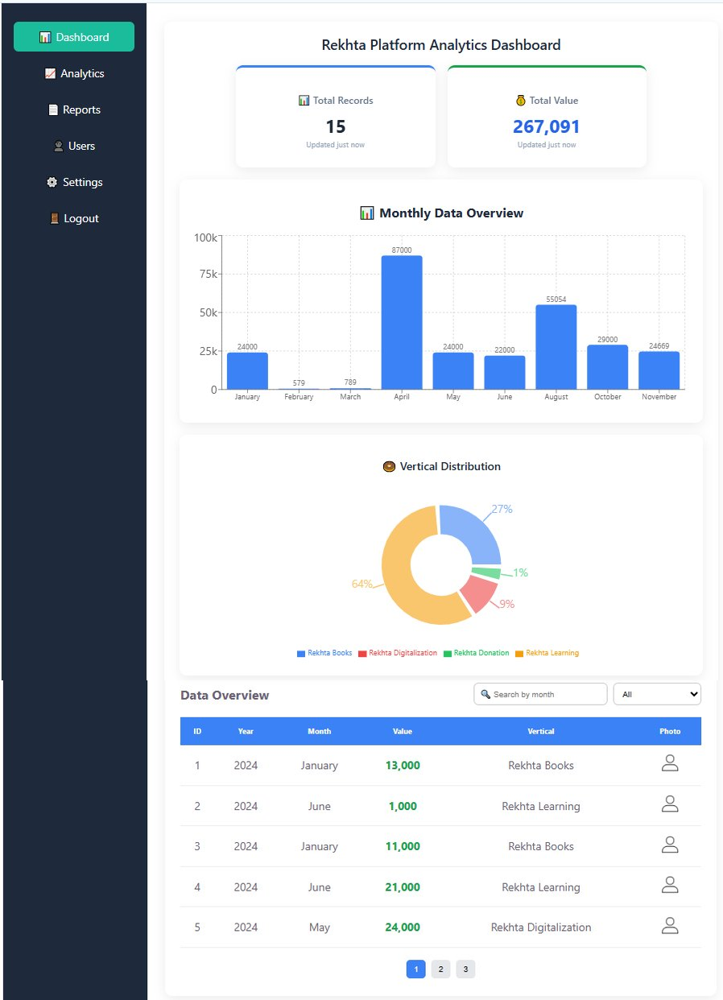
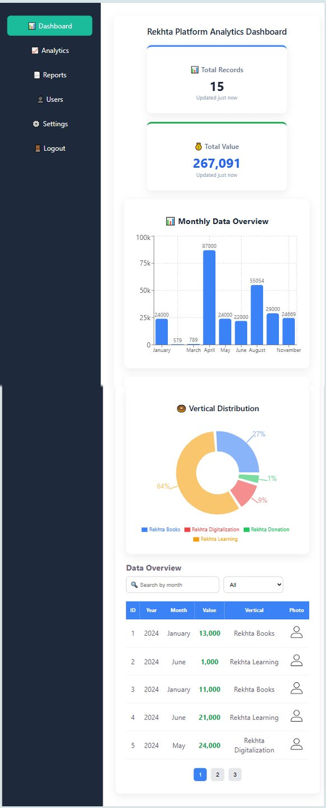
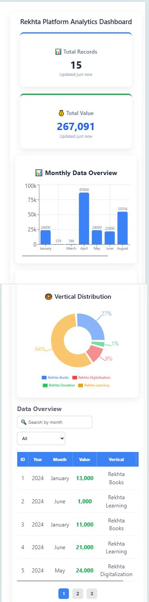
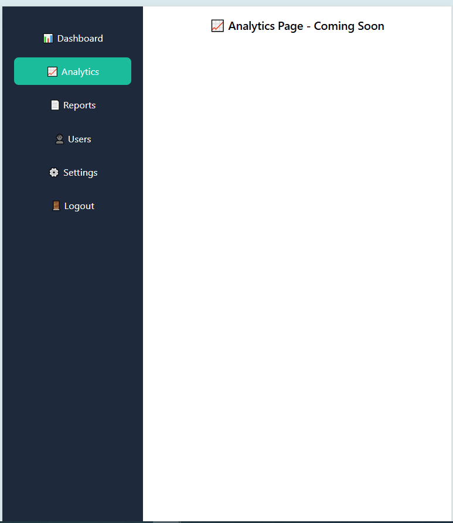

# Rekhta Platform Analytics Dashboard

## 🚀 Features
- API Integration (Mock Data)
- Search by Month
- Filter by Vertical
- Pagination
- Charts (Bar + Pie)

## 🛠 Tech Stack
- React.js (Hooks)
- JavaScript (ES6+)
- CSS
- Vite

## 📊 Functionality
- Dynamic table rendering using `.map()`
- Client-side pagination
- Filtering and searching
- Data visualization

## ▶️ Run Project
npm install  
npm run dev  

## 📸 Screenshots

### 💻 Dashboard-Desktop View

### 📱 Dashboard-Tablet View

### 📱 Dashboard-Mobile View

### 📱 Analytics-Page View

## 👨‍💻 Author
Sudhir Kumar Jha  
LinkedIn: https://linkedin.com/in/sudhir-jha270992
