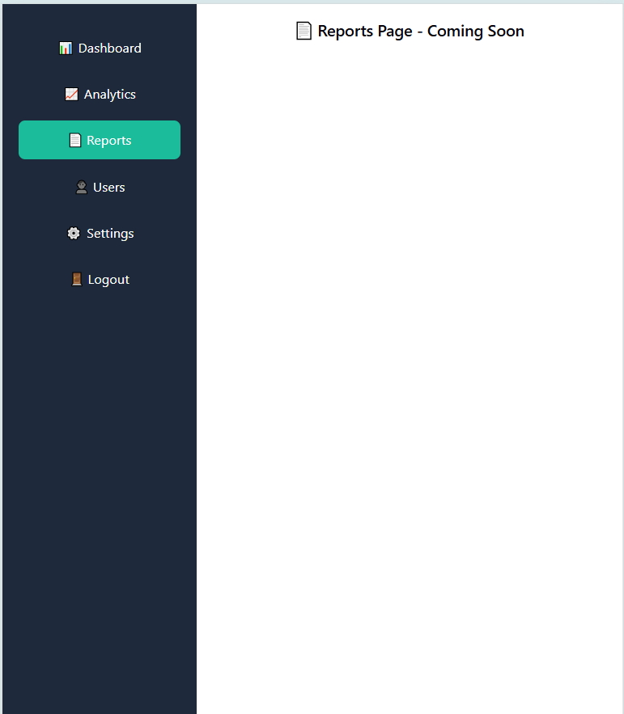
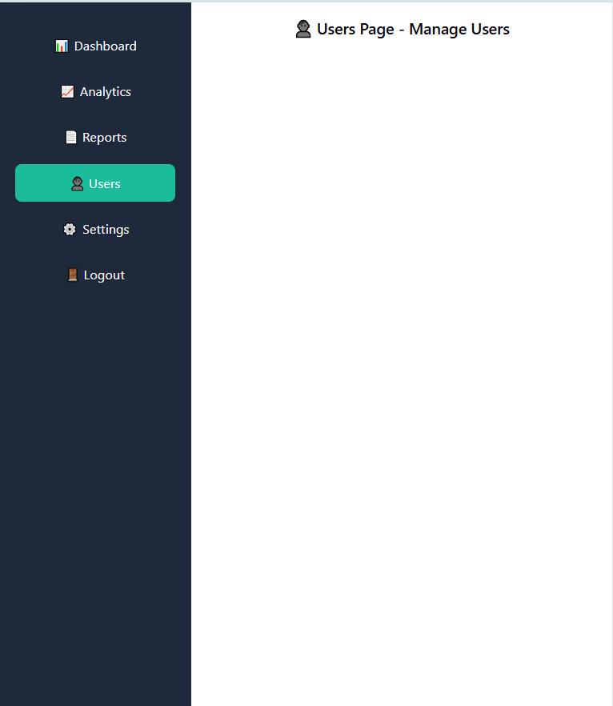

# Rekhta Platform Analytics Dashboard

A responsive React-based analytics dashboard that visualizes data using charts, filtering, search, and pagination. Built to demonstrate frontend development and data visualization skills.

## ⭐ Key Highlights
- Responsive UI (Desktop, Tablet, Mobile)
- Interactive charts using Recharts
- Dynamic filtering and search functionality
- Client-side pagination
- Clean and reusable component-based architecture

  
## 🚀 Live Demo  
🔗 [View Live Project](https://rekhta-platform-analytics-dashboard.vercel.app)


## 🚀 Features
- API Integration (Mock Data)
- Search by Month
- Filter by Vertical
- Pagination
- Charts (Bar + Pie)

## 🛠 Tech Stack
- React.js (Hooks)
- JavaScript (ES6+)
- CSS
- Vite

## 📊 Functionality
- Dynamic table rendering using `.map()`
- Client-side pagination
- Filtering and searching
- Data visualization

## ▶️ Run Project
```bash
npm install
npm run dev


## 📸 Screenshots

### 💻 Dashboard-Desktop View


### 📱 Dashboard-Tablet View


### 📱 Dashboard-Mobile View


### 📱 Analytics-Page View


### 📱 Reports-Page View


### 📱 Users-Page View


## 👨‍💻 Author
Sudhir Kumar Jha  
LinkedIn: https://linkedin.com/in/sudhir-jha270992
